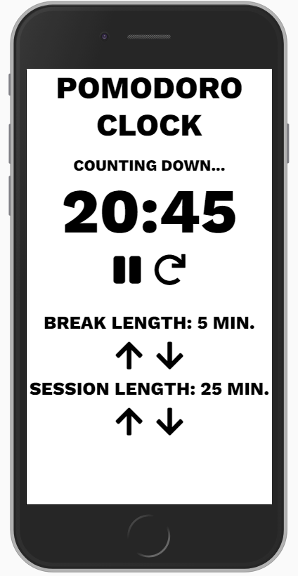

# Front End Libraries Projects - Build a Pomodoro Clock

## Objective
Build a CodePen.io app that is functionally similar to this: https://codepen.io/freeCodeCamp/full/XpKrrW.
A list of user stories for passing the test can be found [here](https://learn.freecodecamp.org/front-end-libraries/front-end-libraries-projects/build-a-pomodoro-clock/). 

## How to run
Follow the steps below to run the project:
1. make sure you have NPM installed
2. clone the project using `git clone https://github.com/electrovagance/FCC-Calculator.git` in your console
3. install yarn using `yarn install` in your console
5. start the development server with `yarn start`
6. app will be hosted locally (i.e., `http://localhost:3000` in your browser)

## Future Todos
* Come up with a clean design!
* Add click effect for buttons
